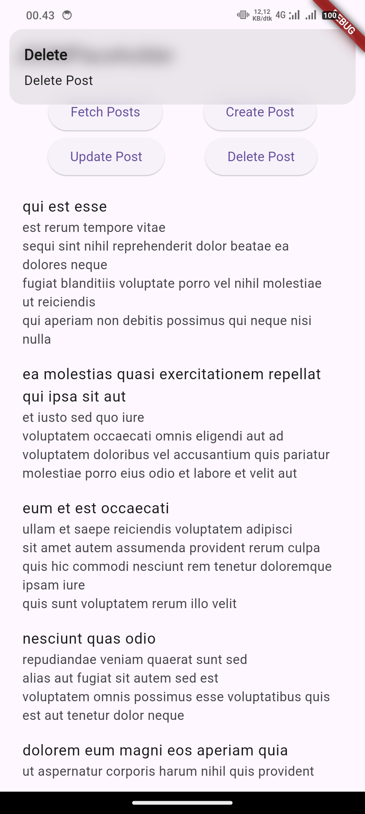

# PERTEMUAN KE 14

## Data Storage 3

---

### GUIDED

1. homescreen

    ``` dart
    import 'package:flutter/material.dart';
    import 'package:guided/service/api_service.dart';

    void main() => runApp(const HomeScreen());

    class HomeScreen extends StatefulWidget {
    const HomeScreen({super.key});

    @override
    State<HomeScreen> createState() => _HomeScreenState();
    }

    class _HomeScreenState extends State<HomeScreen> {
    List<dynamic> _posts = [];
    // Menyimpan list posts
    bool _isLoading = false;
    // Untuk indikator loading
    final ApiService _apiService = ApiService();
    // Instance ApiService
    void _showSnackBar(String message) {
        ScaffoldMessenger.of(context)
            .showSnackBar(SnackBar(content: Text(message)));
    }

    // Fungsi untuk memanggil API dan menangani operasi
    Future<void> _handleApiOperation(
        Future<void> operation, String successMessage) async {
        setState(() {
        _isLoading = true;
        });
        try {
        await operation; // Menjalankan operasi API
        setState(() {
            _posts = _apiService.posts;
        });
        _showSnackBar(successMessage);
        } catch (e) {
        _showSnackBar('Error: $e');
        } finally {
        setState(() {
            _isLoading = false;
        });
        }
    }

    @override
    Widget build(BuildContext context) {
        return MaterialApp(
        title: 'Material App',
        home: Scaffold(
            appBar: AppBar(
            title: const Text('Material App Bar'),
            ),
            body: Padding(
            padding: const EdgeInsets.all(8.0),
            child: Column(
                crossAxisAlignment: CrossAxisAlignment.start,
                children: [
                _isLoading
                    ? const Center(child: CircularProgressIndicator())
                    : _posts.isEmpty
                        ? const Text(
                            "Tekan tombol GET untuk mengambil data",
                            style: TextStyle(fontSize: 12),
                            )
                        : Expanded(
                            child: ListView.builder(
                                itemCount: _posts.length,
                                itemBuilder: (context, index) {
                                return Padding(
                                    padding: const EdgeInsets.only(bottom: 12.0),
                                    child: Card(
                                    elevation: 4,
                                    child: ListTile(
                                        title: Text(
                                        _posts[index]['title'],
                                        style: const TextStyle(
                                            fontWeight: FontWeight.bold,
                                            fontSize: 12),
                                        ),
                                        subtitle: Text(
                                        _posts[index]['body'],
                                        style: const TextStyle(fontSize: 12),
                                        ),
                                    ),
                                    ),
                                );
                                },
                            ),
                            ),
                ElevatedButton(
                    onPressed: () => _handleApiOperation(
                        _apiService.fetchPosts(), 'Data berhasil diambil!'),
                    style: ElevatedButton.styleFrom(backgroundColor: Colors.orange),
                    child: const Text('GET'),
                ),
                ElevatedButton(
                    onPressed: () => _handleApiOperation(
                        _apiService.createPost(), 'Data berhasil ditambahkan!'),
                    style: ElevatedButton.styleFrom(backgroundColor: Colors.green),
                    child: const Text('POST'),
                ),
                ElevatedButton(
                    onPressed: () => _handleApiOperation(
                        _apiService.updatePost(), 'Data berhasil diperbarui!'),
                    style: ElevatedButton.styleFrom(backgroundColor: Colors.blue),
                    child: const Text('UPDATE'),
                ),
                ElevatedButton(
                    onPressed: () => _handleApiOperation(
                        _apiService.deletePost(), 'Data berhasil dihapus!'),
                    style: ElevatedButton.styleFrom(backgroundColor: Colors.red),
                    child: const Text('DELETE'),
                ),
                ],
            ),
            ),
        ),
        );
    }
    }
    ```

2. service

    ``` dart
    import 'dart:convert';

    import 'package:http/http.dart' as http;

    class ApiService {
    final String baseUrl = 'https://jsonplaceholder.typicode.com';
    List<dynamic> posts = [];

    Future<void> fetchPosts() async {
        final response = await http.get(Uri.parse('$baseUrl/posts'));

        if (response.statusCode == 200) {
        posts = jsonDecode(response.body);
        } else {
        throw Exception('Failed to load posts');
        }
    }

    // Fungsi untuk POST data
    Future<void> createPost() async {
        final response = await http.post(
        Uri.parse('$baseUrl/posts'),
        headers: {'Content-Type': 'application/json'},
        body: json.encode({
            'title': 'Flutter Post',
            'body': 'Ini contoh POST.',
            'userId': 1,
        }),
        );
        if (response.statusCode == 201) {
        posts.add({
            'title': 'Flutter Post',
            'body': 'Ini contoh POST.',
            'id': posts.length + 1,
        });
        } else {
        throw Exception('Failed to create post');
        }
    }

    // Fungsi untuk UPDATE data
    Future<void> updatePost() async {
        final response = await http.put(
        Uri.parse('$baseUrl/posts/1'),
        body: json.encode({
            'title': 'Updated Title',
            'body': 'Updated Body',
            'userId': 1,
        }),
        );
        if (response.statusCode == 200) {
        final updatedPost = posts.firstWhere((post) => post['id'] == 1);
        updatedPost['title'] = 'Updated Title';
        updatedPost['body'] = 'Updated Body';
        } else {
        throw Exception('Failed to update post');
        }
    }

    // Fungsi untuk DELETE data
    Future<void> deletePost() async {
        final response = await http.delete(
        Uri.parse('$baseUrl/posts/1'),
        );
        if (response.statusCode == 200) {
        posts.removeWhere((post) => post['id'] == 1);
        } else {
        throw Exception('Failed to delete post');
        }
    }
    }
    ```

---

### UNGUIDED

1. Kodingan
   - main

    ``` dart
    import 'package:flutter/material.dart';
    import 'package:get/get.dart';
    import '../screen/home_screen.dart';

    void main() {
    runApp(const MainApp());
    }

    class MainApp extends StatelessWidget {
    const MainApp({super.key});

    @override
    Widget build(BuildContext context) {
        return GetMaterialApp(
        title: 'Catatan',
        initialRoute: '/',
        getPages: [
            GetPage(name: '/', page: () => HomeScreen()),
        ],
        );
    }
    }
    ```

   - homescreen

    ``` dart
    import 'package:flutter/material.dart';
    import 'package:get/get.dart';
    import '../service/getx_controller.dart';

    void main() => runApp(HomeScreen());

    class HomeScreen extends StatelessWidget {
    HomeScreen({super.key});

    final ControllerX _controller = Get.put(ControllerX());

    @override
    Widget build(BuildContext context) {
        return MaterialApp(
            home: Scaffold(
        appBar: AppBar(
            title: const Text('JSONPlaceholder'),
        ),
        body: Padding(
            padding: const EdgeInsets.all(8.0),
            child: Column(
            children: [
                Row(
                mainAxisAlignment: MainAxisAlignment.spaceEvenly,
                children: [
                    ElevatedButton(
                    onPressed: _controller.fetchPosts,
                    child: const Text('Fetch Posts'),
                    ),
                    ElevatedButton(
                    onPressed: _controller.createPost,
                    child: const Text('Create Post'),
                    ),
                ],
                ),
                Row(
                mainAxisAlignment: MainAxisAlignment.spaceEvenly,
                children: [
                    ElevatedButton(
                    onPressed: _controller.updatePost,
                    child: const Text('Update Post'),
                    ),
                    ElevatedButton(
                    onPressed: _controller.deletePost,
                    child: const Text('Delete Post'),
                    ),
                ],
                ),
                const SizedBox(height: 10),
                Obx(
                () {
                    if (_controller.isLoading.value) {
                    return const CircularProgressIndicator();
                    } else {
                    return Expanded(
                        child: ListView.builder(
                        itemCount: _controller.posts.length,
                        itemBuilder: (context, index) {
                            final post = _controller.posts[index];
                            return ListTile(
                            title: Text(post['title']),
                            subtitle: Text(post['body']),
                            );
                        },
                        ),
                    );
                    }
                },
                ),
            ],
            ),
        ),
        ));
    }
    }
    ```

   - api_service

    ``` dart
    import 'dart:convert';

    import 'package:http/http.dart' as http;

    class ApiService {
    final String baseUrl = 'https://jsonplaceholder.typicode.com';
    List<dynamic> posts = [];

    Future<void> fetchPosts() async {
        final response = await http.get(Uri.parse('$baseUrl/posts'));

        if (response.statusCode == 200) {
        posts = jsonDecode(response.body);
        } else {
        throw Exception('Failed to load posts');
        }
    }

    // Fungsi untuk POST data
    Future<void> createPost() async {
        final response = await http.post(
        Uri.parse('$baseUrl/posts'),
        headers: {'Content-Type': 'application/json'},
        body: json.encode({
            'title': 'Flutter Post',
            'body': 'Ini contoh POST.',
            'userId': 1,
        }),
        );
        if (response.statusCode == 201) {
        posts.add({
            'title': 'Flutter Post',
            'body': 'Ini contoh POST.',
            'id': posts.length + 1,
        });
        } else {
        throw Exception('Failed to create post');
        }
    }

    // Fungsi untuk UPDATE data
    Future<void> updatePost() async {
        final response = await http.put(
        Uri.parse('$baseUrl/posts/1'),
        body: json.encode({
            'title': 'Updated Title',
            'body': 'Updated Body',
            'userId': 1,
        }),
        );
        if (response.statusCode == 200) {
        final updatedPost = posts.firstWhere((post) => post['id'] == 1);
        updatedPost['title'] = 'Updated Title';
        updatedPost['body'] = 'Updated Body';
        } else {
        throw Exception('Failed to update post');
        }
    }

    // Fungsi untuk DELETE data
    Future<void> deletePost() async {
        final response = await http.delete(
        Uri.parse('$baseUrl/posts/1'),
        );
        if (response.statusCode == 200) {
        posts.removeWhere((post) => post['id'] == 1);
        } else {
        throw Exception('Failed to delete post');
        }
    }
    }
    ```

   - getx_controller

    ``` dart
    import 'package:get/get.dart';
    import '../service/api_service.dart';

    class ControllerX extends GetxController {
    var posts = <dynamic>[].obs;
    var isLoading = false.obs;

    final ApiService _apiService = ApiService();

    void showSnackBar(String title, String message) {
        Get.snackbar(title, message, snackPosition: SnackPosition.TOP);
    }

    Future<void> handleApiOperation(
        Future<void> operation, String title, String successMessage) async {
        isLoading.value = true;
        try {
        await operation;
        posts.value = _apiService.posts;
        showSnackBar(title, successMessage);
        } catch (e) {
        showSnackBar("Error", e.toString());
        } finally {
        isLoading.value = false;
        }
    }

    void fetchPosts() =>
        handleApiOperation(_apiService.fetchPosts(), "Fetch", 'Fetch Posts');
    void createPost() =>
        handleApiOperation(_apiService.createPost(), "Create", 'Create Post');
    void updatePost() =>
        handleApiOperation(_apiService.updatePost(), "Update", 'Update Post');
    void deletePost() =>
        handleApiOperation(_apiService.deletePost(), "Delete", 'Delete Post');
    }
    ```

2. Screenshot
   - Fetch <br> 
   - Create <br> 
   - Update <br> 
   - Delete <br> 

3. Penjelasan
   - variabel: `posts` menyimpan daftar post dari API, sedangkan `isLoading` menunjukkan apakah data sedang diambil
   - _apiService: instance dari ApiService untuk melakukan operasi API
   - showSnackBar: Fungsi ini menampilkan notifikasi singkat (snackbar) menggunakan GetX
   - handleApiOperation: Fungsi ini menangani operasi yang akan dilakukan
   - `fetchPosts`, `createPost`, `updatePost`, dan `deletePost`: fungsi untuk memanggil operasi API yang sesuai melalui handleApiOperation
